# **Сравнение производительности кластера Citus на базе Patoni и ArenadataDB на большом объеме данных**


## **Описание цели, схемы и плана тестирования**

### **Цель:** 
Cравнить производительность аналитических запросов кластеров "Citus на базе Patoni" и "ArenadataDB"

### **Схема тестирования:**
- Версия ОS: Ubuntu 22.04
- Конфигурация нод:  
  CPU/8, Mem/16GB, SSD/30GB
- Распределение нод:
  - 3 для мастер нод
  - 6 для воркер нод
- Oграничения:
  - используется виртуализация vmware
  - под капотом один SSD диск на все ВМ
- Датасет для тестирования:  
  [https://zenodo.org/records/7923702](https://zenodo.org/records/7923702)  
  ( открытые данные авиаперелетов с 2019 по 2022 год )


## **Описание установки "кластера Citus на базе Patoni"**

### Схема стенда "кластера Citus на базе Patoni"


### На все ноды в /etc/hosts добавляем
```
192.168.0.231  c-master1
192.168.0.232  c-master2
192.168.0.233  c-master3
192.168.0.234  c-worker1-1
192.168.0.235  c-worker1-2
192.168.0.236  c-worker2-1
192.168.0.237  c-worker2-2
192.168.0.238  c-worker3-1
192.168.0.239  c-worker3-2
```

### На мастер нодах устанавливаем etcd
```
# apt-get install -y etcd
# systemctl stop etcd
```

### Создаем конфиг etcd на каждой мастер ноде.
Пример конфига с ноды c-master1
```
root@c-master1:~# cat /etc/default/etcd 
ETCD_NAME="c-master1"
ETCD_LISTEN_CLIENT_URLS="http://0.0.0.0:2379"
ETCD_ADVERTISE_CLIENT_URLS="http://c-master1:2379"
ETCD_LISTEN_PEER_URLS="http://0.0.0.0:2380"
ETCD_INITIAL_ADVERTISE_PEER_URLS="http://c-master1:2380"
ETCD_INITIAL_CLUSTER_TOKEN="etcd_claster"
ETCD_INITIAL_CLUSTER="c-master1=http://c-master1:2380,c-master2=http://c-master2:2380,c-master3=http://c-master3:2380"
ETCD_INITIAL_CLUSTER_STATE="new"
ETCD_DATA_DIR="/var/lib/etcd"
ETCD_ENABLE_V2="true"
ETCDCRL_API=2
```

### Стартуем etcd на всех мастер нодах и проверяем статус
```
root@c-master1:~# systemctl start etcd

root@c-master1:~# etcdctl member list
5184d67c0e2764e1: name=c-master2 peerURLs=http://c-master2:2380 clientURLs=http://c-master2:2379 isLeader=true
b4d321b6dd227fc9: name=c-master3 peerURLs=http://c-master3:2380 clientURLs=http://c-master3:2379 isLeader=false
bc691ad35811d924: name=c-master1 peerURLs=http://c-master1:2380 clientURLs=http://c-master1:2379 isLeader=false

root@c-master1:~# etcdctl cluster-health
member 5184d67c0e2764e1 is healthy: got healthy result from http://c-master2:2379
member b4d321b6dd227fc9 is healthy: got healthy result from http://c-master3:2379
member bc691ad35811d924 is healthy: got healthy result from http://c-master1:2379
cluster is healthy
```


### На всех нодах устанавливаем демон tuned и создаем профиль для тюнинга ОС под нагрузку сервиса postgresql
```
root@c-master1:~# apt-get install tuned
root@c-master1:~# > /usr/lib/tuned/postgresql/tuned.conf
root@c-master1:~# vim.tiny /usr/lib/tuned/postgresql/tuned.conf 
root@c-master1:~# cat /usr/lib/tuned/postgresql/tuned.conf
[main]
summary=Optimize for PostgreSQL RDBMS
include=throughput-performance
[sysctl]
vm.swappiness = 5
vm.dirty_background_ratio = 10
vm.dirty_ratio = 40
vm.dirty_expire_centisecs = 3000
vm.dirty_writeback_centisecs = 500
kernel.shmmax = 18446744073692700000
kernel.shmall = 18446744073692700000
kernel.shmmni = 4096
kernel.sem = 250 512000 100 2048
fs.file-max = 312139770
fs.aio-max-nr = 1048576
net.ipv4.ip_local_port_range = 2048 65499
# Permits sockets in the time-wait state to be reused for new connections:
net.ipv4.tcp_tw_reuse = 1
net.core.netdev_budget = 1024
net.core.netdev_max_backlog = 2048
net.core.rmem_default = 262144
net.core.rmem_max = 4194304
net.core.wmem_default = 262144
net.core.wmem_max = 1048576
kernel.panic_on_oops = 1
# We don't need NUMA balancing in this box:
kernel.numa_balancing = 0
# Used if not defined by the service:
net.core.somaxconn = 4096
# Other parameters to override throughput-performance template
net.ipv4.tcp_rmem = 4096 87380 16777216
net.ipv4.tcp_wmem = 4096 65536 16777216
net.ipv4.tcp_window_scaling = 1
net.netfilter.nf_conntrack_max = 250000
net.ipv4.tcp_max_syn_backlog=4096
[vm]
transparent_hugepages=never


root@c-master1:~# tuned-adm active ; tuned-adm profile postgresql ;tuned-adm active
```


### Получение конфигурации для тюнинга postgresql 
Используя онлайн конфигуратор https://www.pgconfig.org  
и характеристики нод, получаем:
```
# https://www.pgconfig.org
# Generated by PGConfig 3.1.4 (1fe6d98dedcaad1d0a114617cfd08b4fed1d8a01)
# https://api.pgconfig.org/v1/tuning/get-config?format=conf&&log_format=csvlog&max_connections=100&pg_version=16&environment_name=DW&total_ram=16GB&cpus=8&drive_type=SSD&arch=x86-64&os_type=linux

# Memory Configuration
shared_buffers = 4GB
effective_cache_size = 12GB
work_mem = 82MB
maintenance_work_mem = 819MB

# Checkpoint Related Configuration
min_wal_size = 2GB
max_wal_size = 3GB
checkpoint_completion_target = 0.9
wal_buffers = -1

# Network Related Configuration
listen_addresses = '*'
max_connections = 100

# Storage Configuration
random_page_cost = 1.1
effective_io_concurrency = 200

# Worker Processes Configuration
max_worker_processes = 8
max_parallel_workers_per_gather = 2
max_parallel_workers = 2
```


### Устанавливаем postgresql и patroni на всех нодах кластера и создаем директорию для базы данных:
(на всех нодах)
```
root@c-master1:~# echo "deb [arch=amd64] http://apt.postgresql.org/pub/repos/apt $(lsb_release -cs)-pgdg main" > /etc/apt/sources.list.d/postgresql.list
root@c-master1:~# wget --quiet -O - https://www.postgresql.org/media/keys/ACCC4CF8.asc | sudo apt-key add -
root@c-master1:~# curl https://install.citusdata.com/community/deb.sh > add-citus-repo.sh
root@c-master1:~# . ./add-citus-repo.sh
root@c-master1:~# apt-get install -y postgresql-16 postgresql-16-citus-13.0 postgresql-16-postgis-3 patroni python3-etcd
root@c-master1:~# systemctl stop postgresql.service ; systemctl disable postgresql.service
root@c-master1:~# systemctl enable patroni ; systemctl stop patroni
root@c-master1:~# mkdir -p /data/pg/ ; chown postgres:postgres /data/pg ; chmod go-rx /data/pg
```

### Создаем конфигурационный файл /etc/patroni/config.yml
```
scope: patroni
name: c-master1
restapi:
  listen: 0.0.0.0:8008
  connect_address: c-master1:8008
etcd:
  hosts: c-master1:2379,c-master2:2379,c-master3:2379
citus:
  group: 0
  database: otus
bootstrap:
  dcs:
    ttl: 30
    loop_wait: 10
    retry_timeout: 10
    maximum_lag_on_failover: 1048576
    postgresql:
      use_pg_rewind: true
      parameters:
        checkpoint_completion_target: 0.9
        effective_cache_size: 12GB
        effective_io_concurrency: 200
        maintenance_work_mem: 819MB
        max_connections: 100
        max_parallel_workers: 2
        max_parallel_workers_per_gather: 2
        max_wal_size: 3GB
        max_worker_processes: 8
        min_wal_size: 2GB
        random_page_cost: 1.1
        shared_buffers: 4GB
        wal_buffers: -1
        work_mem: 82MB
  initdb:
  - encoding: UTF8
  - data-checksums
  pg_hba:
  - host replication replicator 0.0.0.0/0 md5
  - host all all 0.0.0.0/0 md5
  users:
    admin:
      password: qwerty
      options:
        - createrole
        - createdb
postgresql:
  listen: 0.0.0.0:5432
  connect_address: c-master1:5432
  data_dir: /data/pg/
  bin_dir: /usr/lib/postgresql/16/bin/
  pgpass: /tmp/pgpass0
  authentication:
    replication:
      username: replicator
      password: qwerty
    superuser:
      username: postgres
      password: qwerty
    rewind:
      username: rewind_user
      password: qwerty
  parameters:
    unix_socket_directories: '.'
tags:
    nofailover: false
    noloadbalance: false
    clonefrom: false
    nosync: false
```
, где
- name, restapi.connect_address, postgresql.connect_address - меняем на имя ноды
- citus.group - устанавливаем 0 на мастерах, 1 на c-worker1-[1,2], 2 на c-worker2-[1,2], 3 на c-worker3-[1,2]
- bootstrap.dcs.postgresql.parameters - добавляем параметры полученные с https://www.pgconfig.org


### Стартуем patroni на мастер нодах
```
root@c-master1:~#  systemctl stаrt patroni
```
### Проверяем статус patroni на мастер нодах
```
root@c-master1:~# patronictl --config-file=/etc/patroni/config.yml list
+ Citus cluster: patroni -------+----------------+-----------+----+-----------+
| Group | Member    | Host      | Role           | State     | TL | Lag in MB |
+-------+-----------+-----------+----------------+-----------+----+-----------+
|     0 | c-master1 | c-master1 | Leader         | running   |  1 |           |
|     0 | c-master2 | c-master2 | Quorum Standby | streaming |  1 |         0 |
|     0 | c-master3 | c-master3 | Quorum Standby | streaming |  1 |         0 |
+-------+-----------+-----------+----------------+-----------+----+-----------+
```

### Затем стартуем patroni на воркер нодах 
сначала все с индексом "1", затем с индексом "2",  
и проверяем статус нод кластера:
```
root@c-worker1-1:~#  systemctl stаrt patroni

root@c-worker1-1:~# patronictl --config-file=/etc/patroni/config.yml list
+ Citus cluster: patroni -----------+----------------+-----------+----+-----------+
| Group | Member      | Host        | Role           | State     | TL | Lag in MB |
+-------+-------------+-------------+----------------+-----------+----+-----------+
|     0 | c-master1   | c-master1   | Leader         | running   |  1 |           |
|     0 | c-master2   | c-master2   | Quorum Standby | streaming |  1 |         0 |
|     0 | c-master3   | c-master3   | Quorum Standby | streaming |  1 |         0 |
|     1 | c-worker1-1 | c-worker1-1 | Leader         | running   |  1 |           |
|     1 | c-worker1-2 | c-worker1-2 | Quorum Standby | streaming |  1 |         0 |
|     2 | c-worker2-1 | c-worker2-1 | Leader         | running   |  1 |           |
|     2 | c-worker2-2 | c-worker2-2 | Quorum Standby | streaming |  1 |         0 |
|     3 | c-worker3-1 | c-worker3-1 | Leader         | running   |  1 |           |
|     3 | c-worker3-2 | c-worker3-2 | Quorum Standby | streaming |  1 |         0 |
+-------+-------------+-------------+----------------+-----------+----+-----------+
```


## **Описание установки кластера ArenadataDB**

### Схема стенда кластера ArenadataDB


### Установка Arenadata Cluster Manager (ADCM)  
Установку ArenadataDB будем производить с помощью инструмента ADCM.  
[Arenadata Cluster Manager (ADCM)](https://docs.arenadata.io/ru/landing-adcm/index.html "Arenadata Cluster Manager")  

**ADCM** представляет собой приложение оформленное в виде докер образа, которое позволяет, используя заранее подготовленные  
"bundle", устанавливать ArenadataDB используя графический интерфейс.  

**Бандл (bundle)** — это объект ADCM, который нужен для установки и развёртывания различных компонентов кластера.
По существу, бандл является tar архивом, с ansible плейбуками. 

**Инструкция по установке ADCM:**  
[https://docs.arenadata.io/ru/ADCM/current/get-started/install.html](https://docs.arenadata.io/ru/ADCM/current/get-started/install.html)


Для ADCM будем использовать выделенную VM c IP 192.168.0.49

Выбираем последнюю (на тек. момент) версию ADCM, запускаем докер образ и проверяем его статус:
```
# docker create --name adcm -p 8000:8000 -v /opt/adcm:/adcm/data -e LOG_LEVEL="INFO" hub.arenadata.io/adcm/adcm:2.5.1

# docker start adcm
adcm

# docker ps -a
CONTAINER ID   IMAGE                              COMMAND             CREATED              STATUS         PORTS                    NAMES
ca75c764c602   hub.arenadata.io/adcm/adcm:2.5.1   "/etc/startup.sh"   About a minute ago   Up 3 seconds   0.0.0.0:8000->8000/tcp   adcm
```

В браузере открываем URL: http://192.168.0.49:8000


Дефолтные реквизиты для входа:
```
User: admin
Password: admin
```


Согласно документации установим url http://192.168.0.49:8000:  
[Установка URL ADCM](https://docs.arenadata.io/ru/ADCM/current/get-started/install.html#adcm-url)

Скачиваем bundle:  
[bundle для ArenadataDB версии 7.2.0_arenadata1_b1](https://network.arenadata.io/arenadata-db/downloads#7.2.0_arenadata1_b1)
[bundle SSH версии 2.13](https://network.arenadata.io/arenadata-cluster-manager/bundles)
[bundle Arenadata Monitoring версии 4.1.1](https://network.arenadata.io/arenadata-monitoring)

Загруженные bundle:
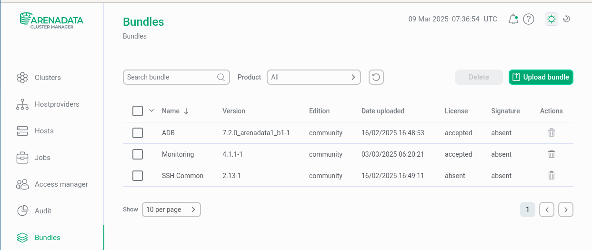

На основе загруженных bundle создаем "рыбу" для кластера ArenadataDB и сервиса Мониторинга:
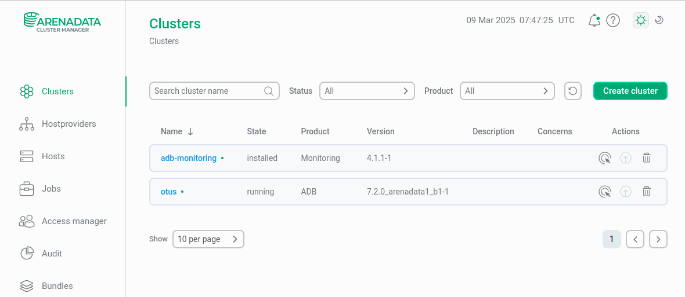

Создаем инвентори:
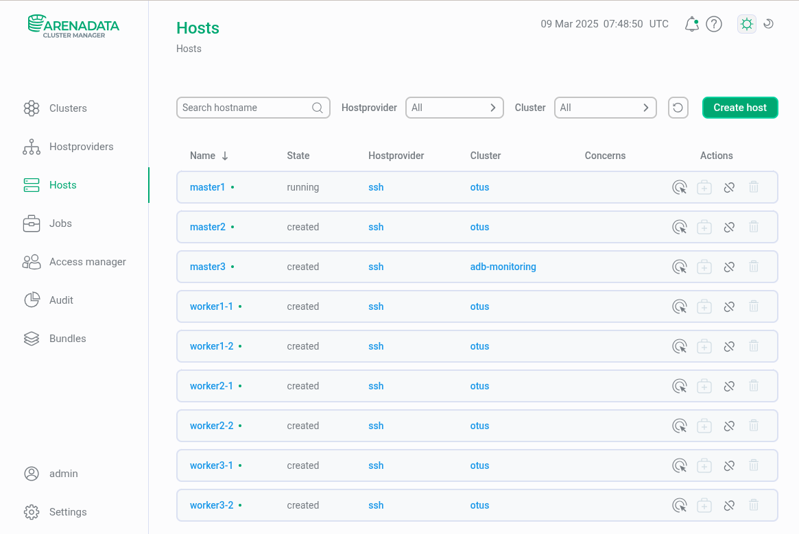

Пример конфигурации хоста master1:
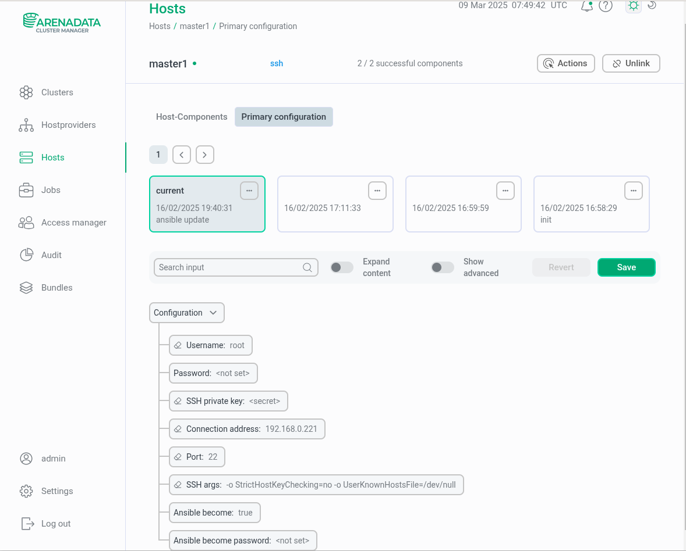

Маппим хосты к соответствующим сервисам ArenadataDB и Мониторинга:
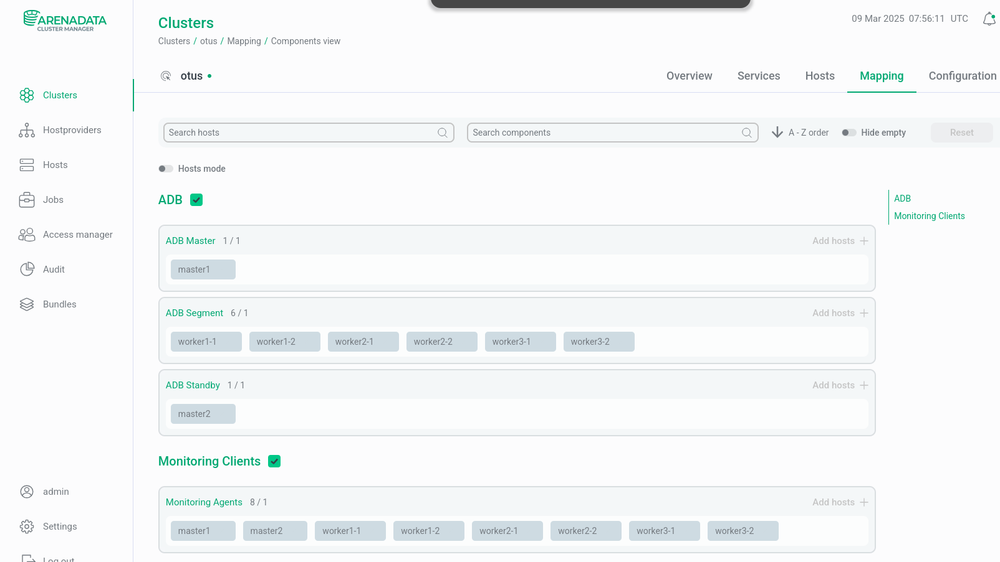

Задаем конфигурацию ArenadataDB:


Инсталлируем ArenadataDB и сервис Мониторинга:
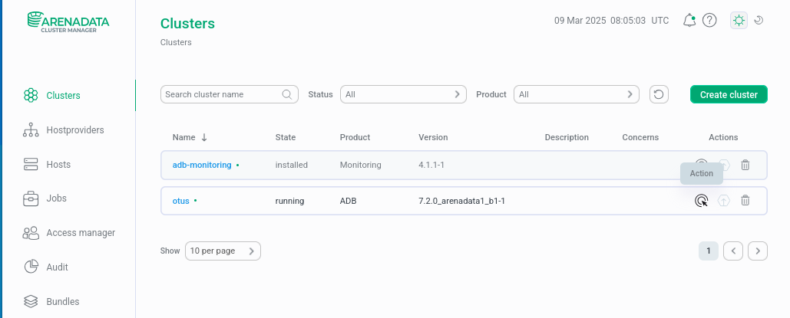

Контроль установки:
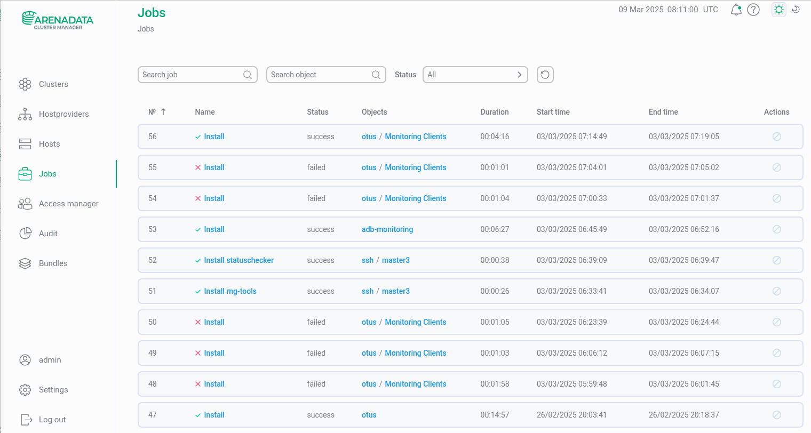

Статус кластера ADB:


Статус кластера Monitoring:


Проверка доступности дашбордов в кластере Monitoring ADB:
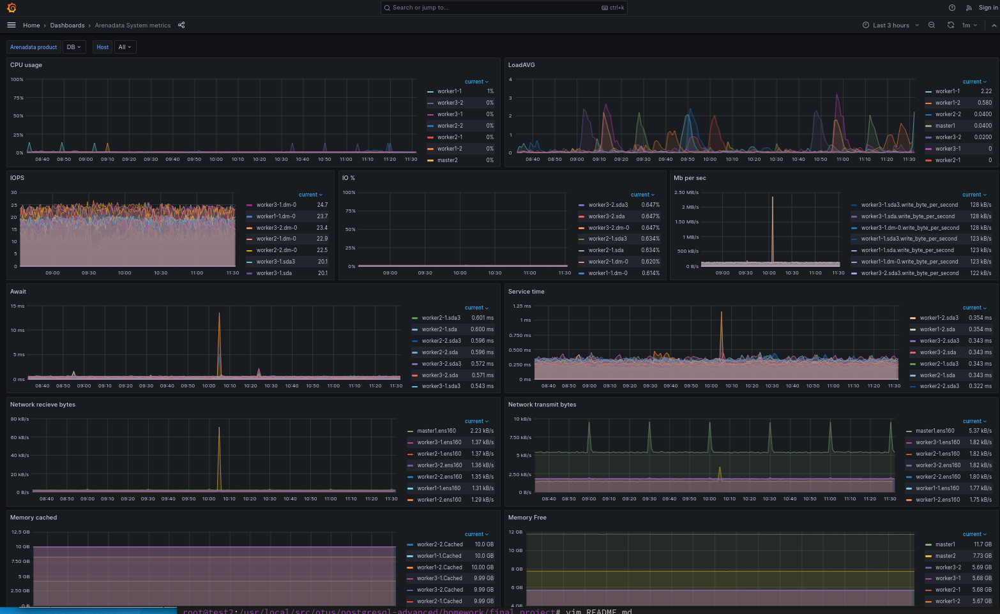
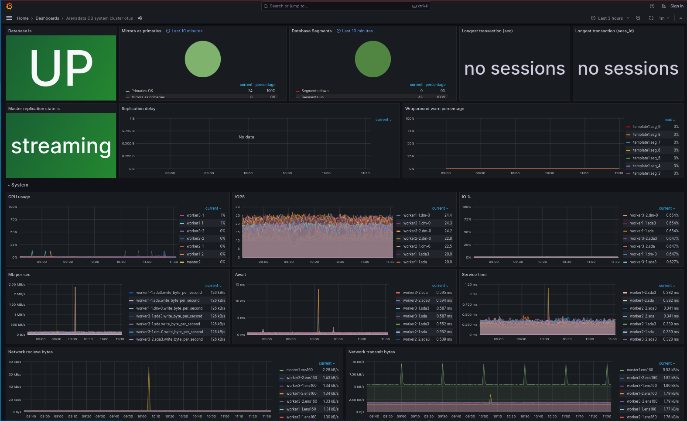


## **Установка мониторинга для кластера Citus**

### Устанавливаем на все ноды prometheus-node-exporter
```
root@c-master1:~# apt-get install -y prometheus-node-exporter ^C

root@c-master1:~# systemctl status prometheus-node-exporter.service
● prometheus-node-exporter.service - Prometheus exporter for machine metrics
     Loaded: loaded (/lib/systemd/system/prometheus-node-exporter.service; enabled; vendor preset: enabled)
     Active: active (running) since Thu 2025-02-27 21:13:08 UTC; 1 week 2 days ago
       Docs: https://github.com/prometheus/node_exporter
   Main PID: 35143 (prometheus-node)
      Tasks: 19 (limit: 19056)
     Memory: 12.7M
        CPU: 1h 45min 18.412s
     CGroup: /system.slice/prometheus-node-exporter.service
             └─35143 /usr/bin/prometheus-node-exporter

Feb 27 21:13:08 c-master1 prometheus-node-exporter[35143]: ts=2025-02-27T21:13:08.368Z caller=node_exporter.go:115 level=info collector=thermal_zone
Feb 27 21:13:08 c-master1 prometheus-node-exporter[35143]: ts=2025-02-27T21:13:08.368Z caller=node_exporter.go:115 level=info collector=time
Feb 27 21:13:08 c-master1 prometheus-node-exporter[35143]: ts=2025-02-27T21:13:08.368Z caller=node_exporter.go:115 level=info collector=timex
Feb 27 21:13:08 c-master1 prometheus-node-exporter[35143]: ts=2025-02-27T21:13:08.368Z caller=node_exporter.go:115 level=info collector=udp_queues
Feb 27 21:13:08 c-master1 prometheus-node-exporter[35143]: ts=2025-02-27T21:13:08.368Z caller=node_exporter.go:115 level=info collector=uname
Feb 27 21:13:08 c-master1 prometheus-node-exporter[35143]: ts=2025-02-27T21:13:08.369Z caller=node_exporter.go:115 level=info collector=vmstat
Feb 27 21:13:08 c-master1 prometheus-node-exporter[35143]: ts=2025-02-27T21:13:08.369Z caller=node_exporter.go:115 level=info collector=xfs
Feb 27 21:13:08 c-master1 prometheus-node-exporter[35143]: ts=2025-02-27T21:13:08.369Z caller=node_exporter.go:115 level=info collector=zfs
Feb 27 21:13:08 c-master1 prometheus-node-exporter[35143]: ts=2025-02-27T21:13:08.369Z caller=node_exporter.go:199 level=info msg="Listening on" address=:9100
Feb 27 21:13:08 c-master1 prometheus-node-exporter[35143]: ts=2025-02-27T21:13:08.369Z caller=tls_config.go:195 level=info msg="TLS is disabled." http2=false
```

### Устанавливаем на мастер ноды prometheus-postgres-exporter
```
root@c-master1:~# apt-get install -y prometheus-postgres-exporter ^C

root@c-master1:~# grep -v '^#' /etc/default/prometheus-postgres-exporter
DATA_SOURCE_NAME="postgresql://postgres@127.0.0.1:5432/otus?sslmode=disable"
ARGS=''

root@c-master1:~# systemctl restart prometheus-postgres-exporter

root@c-master1:~# systemctl status prometheus-postgres-exporter.service
● prometheus-postgres-exporter.service - Prometheus exporter for PostgreSQL
     Loaded: loaded (/lib/systemd/system/prometheus-postgres-exporter.service; enabled; vendor preset: enabled)
     Active: active (running) since Fri 2025-02-28 13:06:54 UTC; 1 week 1 day ago
       Docs: https://github.com/prometheus-community/postgres_exporter
   Main PID: 57941 (prometheus-post)
      Tasks: 12 (limit: 19056)
     Memory: 10.1M
        CPU: 14min 24.012s
     CGroup: /system.slice/prometheus-postgres-exporter.service
             └─57941 /usr/bin/prometheus-postgres-exporter

Feb 28 13:06:54 c-master1 systemd[1]: Started Prometheus exporter for PostgreSQL.
Feb 28 13:06:54 c-master1 prometheus-postgres-exporter[57941]: ts=2025-02-28T13:06:54.421Z caller=main.go:123 level=info msg="Listening on address" address=:9187
Feb 28 13:06:54 c-master1 prometheus-postgres-exporter[57941]: ts=2025-02-28T13:06:54.422Z caller=tls_config.go:195 level=info msg="TLS is disabled." http2=false
Mar 03 05:47:55 c-master1 prometheus-postgres-exporter[57941]: ts=2025-03-03T05:47:55.950Z caller=server.go:74 level=info msg="Established new database connection" fingerprint=127.0.0.1:5432
Mar 03 05:47:55 c-master1 prometheus-postgres-exporter[57941]: ts=2025-03-03T05:47:55.980Z caller=postgres_exporter.go:662 level=info msg="Semantic version changed" server=127.0.0.1:5432 from=0.0.0 to=16.8.0
```

### Для сбора метрик с экспортеров, устанавливаем и конфигурируем prometheus
( на отдельной виртуалке 192.168.0.49 )  

Подготовка директорий для prometheus:
```
[root@docker /]# mkdir /data/prometheus-data
[root@docker /]# chown nobody:nobody /data/prometheus-data
[root@docker /]# mkdir /data/prometheus-data
```

Создание конфигурационного файла для prometheus:
```
[root@docker /]# cat /opt/prometheus/prometheus.yml
global:
  scrape_interval: 30s
  evaluation_interval: 30s
scrape_configs:
  - job_name: 'prometheus'
    scrape_interval: 30s
    static_configs:
      - targets: ['localhost:9090']
  - job_name: 'arenadatadb'
    scrape_interval: 30s
    static_configs:
      - targets:
        - 192.168.0.221:9100
        - 192.168.0.222:9100
        - 192.168.0.223:9100
        - 192.168.0.224:9100
        - 192.168.0.225:9100
        - 192.168.0.226:9100
        - 192.168.0.227:9100
        - 192.168.0.228:9100
        - 192.168.0.229:9100
        labels:
          cluster: 'arenadatadb'
  - job_name: 'citus'
    scrape_interval: 30s
    static_configs:
      - targets:
        - 192.168.0.231:9100
        - 192.168.0.232:9100
        - 192.168.0.233:9100
        - 192.168.0.234:9100
        - 192.168.0.235:9100
        - 192.168.0.236:9100
        - 192.168.0.237:9100
        - 192.168.0.238:9100
        - 192.168.0.239:9100
        labels:
          cluster: 'citus'
  - job_name: 'patroni'
    scrape_interval: 30s
    static_configs:
      - targets:
        - 192.168.0.231:8008
        - 192.168.0.232:8008
        - 192.168.0.233:8008
        - 192.168.0.234:8008
        - 192.168.0.235:8008
        - 192.168.0.236:8008
        - 192.168.0.237:8008
        - 192.168.0.238:8008
        - 192.168.0.239:8008
        labels:
          cluster: 'citus'


  - job_name: greenplum
    scrape_interval: 30s
    static_configs:
      - targets: ['192.168.0.221:9187']
        labels:
          cluster: arenadatadb
          role: master

  - job_name: citus-masters
    scrape_interval: 30s
    static_configs:
      - targets: ['192.168.0.231:9187']
        labels:
          cluster: citus
          role: master
```

### Запуск prometheus:
```
[root@docker /]# docker run -d --name prometheus -p 9090:9090 -v /opt/prometheus/prometheus.yml:/etc/prometheus/prometheus.yml -v /data/prometheus-data:/prometheus prom/prometheus
```

### Подключаем prometheus к графане, с официального сайта графаны загружаем дашборды node-exporter и postgres-exporter.
#### Дашборд Node-exporter
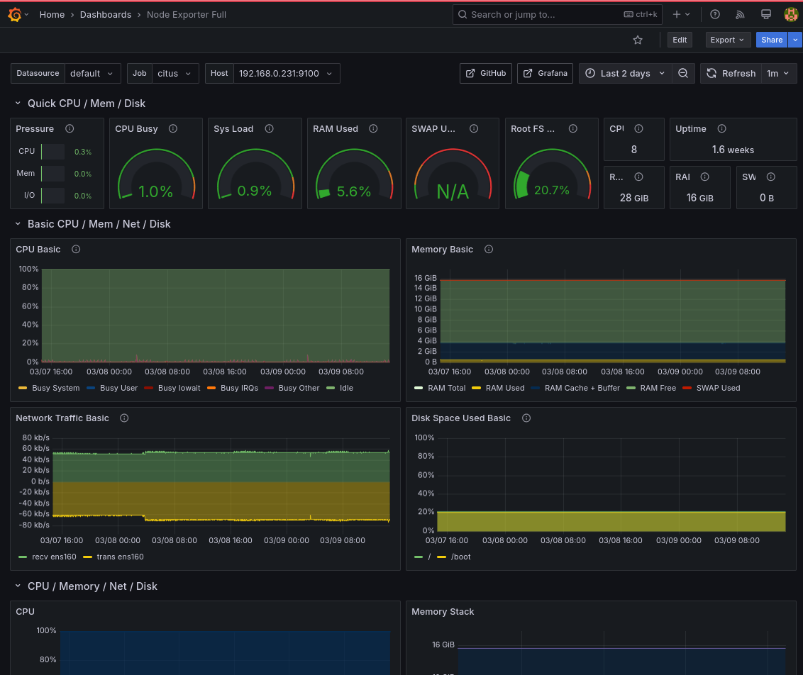
#### Дашборд Prometheus-exporter
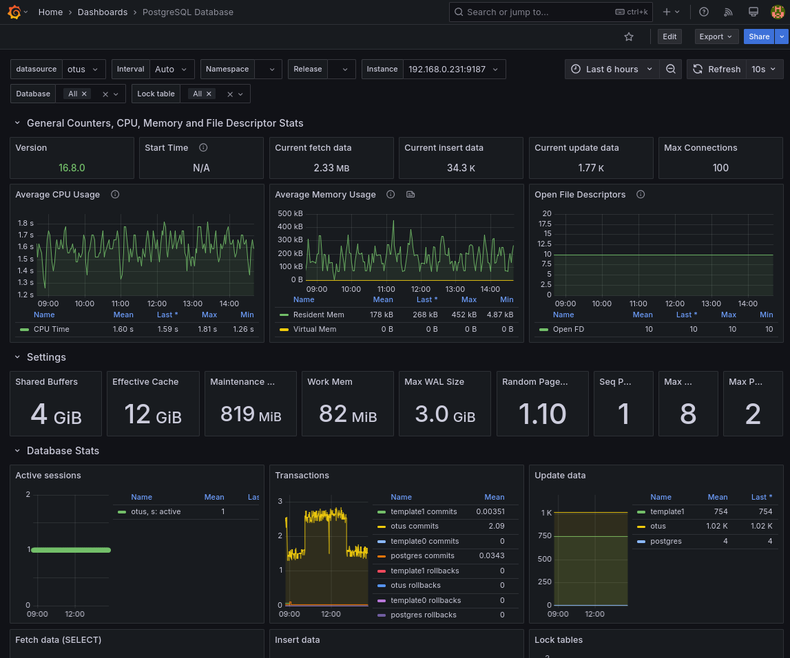 


## **Загрузка датасета**

### Загружаем датасет на стенбай мастер кластера Citus и на стенбай мастер кластера ArenadataDB
Пример загруженного датасета:
```
root@c-master2:~# wget -O- https://zenodo.org/record/7923702 | grep -oP 'https://zenodo.org/records/7923702/files/flightlist_\d+_\d+\.csv\.gz' | xargs wget

root@c-master2:~# ll /data/csv
total 7956748
drwxr-xr-x 2 postgres postgres      4096 Mar  9 18:32 ./
drwxr-xr-x 4 root     root          4096 Mar  9 17:35 ../
-rw-r--r-- 1 root     root     149656072 Mar  9 18:31 flightlist_20190101_20190131.csv.gz
-rw-r--r-- 1 root     root     139872800 Mar  9 18:31 flightlist_20190201_20190228.csv.gz
-rw-r--r-- 1 root     root     159072441 Mar  9 18:31 flightlist_20190301_20190331.csv.gz
-rw-r--r-- 1 root     root     166006708 Mar  9 18:31 flightlist_20190401_20190430.csv.gz
-rw-r--r-- 1 root     root     177692774 Mar  9 18:31 flightlist_20190501_20190531.csv.gz
-rw-r--r-- 1 root     root     185886065 Mar  9 18:31 flightlist_20190601_20190630.csv.gz
-rw-r--r-- 1 root     root     202954345 Mar  9 18:31 flightlist_20190701_20190731.csv.gz
-rw-r--r-- 1 root     root     209558770 Mar  9 18:31 flightlist_20190801_20190831.csv.gz
-rw-r--r-- 1 root     root     201172745 Mar  9 18:31 flightlist_20190901_20190930.csv.gz
-rw-r--r-- 1 root     root     206358695 Mar  9 18:31 flightlist_20191001_20191031.csv.gz
-rw-r--r-- 1 root     root     190775945 Mar  9 18:31 flightlist_20191101_20191130.csv.gz
-rw-r--r-- 1 root     root     194400731 Mar  9 18:31 flightlist_20191201_20191231.csv.gz
-rw-r--r-- 1 root     root     193891069 Mar  9 18:31 flightlist_20200101_20200131.csv.gz
-rw-r--r-- 1 root     root     186334754 Mar  9 18:31 flightlist_20200201_20200229.csv.gz
-rw-r--r-- 1 root     root     151571888 Mar  9 18:31 flightlist_20200301_20200331.csv.gz
-rw-r--r-- 1 root     root      58544368 Mar  9 18:31 flightlist_20200401_20200430.csv.gz
-rw-r--r-- 1 root     root      75376842 Mar  9 18:31 flightlist_20200501_20200531.csv.gz
-rw-r--r-- 1 root     root     100336756 Mar  9 18:31 flightlist_20200601_20200630.csv.gz
-rw-r--r-- 1 root     root     134445252 Mar  9 18:31 flightlist_20200701_20200731.csv.gz
-rw-r--r-- 1 root     root     144364225 Mar  9 18:31 flightlist_20200801_20200831.csv.gz
-rw-r--r-- 1 root     root     136524682 Mar  9 18:31 flightlist_20200901_20200930.csv.gz
-rw-r--r-- 1 root     root     138560754 Mar  9 18:31 flightlist_20201001_20201031.csv.gz
-rw-r--r-- 1 root     root     126932585 Mar  9 18:31 flightlist_20201101_20201130.csv.gz
-rw-r--r-- 1 root     root     132372973 Mar  9 18:31 flightlist_20201201_20201231.csv.gz
-rw-r--r-- 1 root     root     123902516 Mar  9 18:31 flightlist_20210101_20210131.csv.gz
-rw-r--r-- 1 root     root     112332587 Mar  9 18:31 flightlist_20210201_20210228.csv.gz
-rw-r--r-- 1 root     root     144126125 Mar  9 18:31 flightlist_20210301_20210331.csv.gz
-rw-r--r-- 1 root     root     154290585 Mar  9 18:31 flightlist_20210401_20210430.csv.gz
-rw-r--r-- 1 root     root     158083429 Mar  9 18:31 flightlist_20210501_20210530.csv.gz
-rw-r--r-- 1 root     root     174242634 Mar  9 18:32 flightlist_20210601_20210630.csv.gz
-rw-r--r-- 1 root     root     195182845 Mar  9 18:32 flightlist_20210701_20210731.csv.gz
-rw-r--r-- 1 root     root     193553663 Mar  9 18:32 flightlist_20210801_20210831.csv.gz
-rw-r--r-- 1 root     root     185958001 Mar  9 18:32 flightlist_20210901_20210930.csv.gz
-rw-r--r-- 1 root     root     189178314 Mar  9 18:32 flightlist_20211001_20211031.csv.gz
-rw-r--r-- 1 root     root     171793207 Mar  9 18:32 flightlist_20211101_20211130.csv.gz
-rw-r--r-- 1 root     root     176995596 Mar  9 18:32 flightlist_20211201_20211231.csv.gz
-rw-r--r-- 1 root     root     167006123 Mar  9 18:32 flightlist_20220101_20220131.csv.gz
-rw-r--r-- 1 root     root     160501286 Mar  9 18:32 flightlist_20220201_20220228.csv.gz
-rw-r--r-- 1 root     root     192174807 Mar  9 18:32 flightlist_20220301_20220331.csv.gz
-rw-r--r-- 1 root     root     195130216 Mar  9 18:32 flightlist_20220401_20220430.csv.gz
-rw-r--r-- 1 root     root     209922004 Mar  9 18:32 flightlist_20220501_20220531.csv.gz
-rw-r--r-- 1 root     root     219288475 Mar  9 18:32 flightlist_20220601_20220630.csv.gz
-rw-r--r-- 1 root     root     225113029 Mar  9 18:32 flightlist_20220701_20220731.csv.gz
-rw-r--r-- 1 root     root     225536716 Mar  9 18:32 flightlist_20220801_20220831.csv.gz
-rw-r--r-- 1 root     root     214355323 Mar  9 18:32 flightlist_20220901_20220930.csv.gz
-rw-r--r-- 1 root     root     219114157 Mar  9 18:32 flightlist_20221001_20221031.csv.gz
-rw-r--r-- 1 root     root     194265689 Mar  9 18:32 flightlist_20221101_20221130.csv.gz
-rw-r--r-- 1 root     root     182693445 Mar  9 18:33 flightlist_20221201_20221231.csv.gz
```

### Загрузка датасета в кластер Citus

```
postgres@c-master2:~$ cd /data/csv/
postgres@c-master2:/data/csv$ psql -h 192.168.0.231 -U postgres -d otus
psql (16.8 (Ubuntu 16.8-1.pgdg22.04+1))
SSL connection (protocol: TLSv1.3, cipher: TLS_AES_256_GCM_SHA384, compression: off)
Type "help" for help.

otus=#
otus=# CREATE EXTENSION IF NOT EXISTS postgis;

otus=# \dx
                                    List of installed extensions
      Name      | Version |   Schema   |                        Description                         
----------------+---------+------------+------------------------------------------------------------
 citus          | 13.0-1  | pg_catalog | Citus distributed database
 citus_columnar | 11.3-1  | pg_catalog | Citus Columnar extension
 plpgsql        | 1.0     | pg_catalog | PL/pgSQL procedural language
 postgis        | 3.5.2   | public     | PostGIS geometry and geography spatial types and functions
(4 rows)

otus=# CREATE TABLE opensky
(
    callsign TEXT,
    number TEXT,
    icao24 TEXT,
    registration TEXT,
    typecode TEXT,
    origin TEXT,
    destination TEXT NULL,
    firstseen TIMESTAMP WITH TIME ZONE NOT NULL,
    lastseen TIMESTAMP WITH TIME ZONE NOT NULL,
    day TIMESTAMP WITH TIME ZONE NOT NULL,
    latitude_1 NUMERIC,
    longitude_1 NUMERIC,
    altitude_1 NUMERIC,
    latitude_2 NUMERIC,
    longitude_2 NUMERIC,
    altitude_2 NUMERIC
) PARTITION BY RANGE (firstseen);
CREATE TABLE
otus=# 
otus=# SELECT create_distributed_table('opensky', 'callsign');
 create_distributed_table 
--------------------------
 
(1 row)

otus=# SELECT create_time_partitions(
  table_name         := 'opensky',
  partition_interval := '1 month',
  start_from         := '2018-12-01 00:00:00',
  end_at             := '2023-01-31 23:59:59'
);
 create_time_partitions 
------------------------
 t
(1 row)

otus=#
otus=# CALL alter_old_partitions_set_access_method('opensky','2023-01-31 23:59:59', 'columnar' );
NOTICE:  converting opensky_p2018_12 with start time 2018-12-01 00:00:00+00 and end time 2019-01-01 00:00:00+00
NOTICE:  creating a new table for public.opensky_p2018_12
NOTICE:  moving the data of public.opensky_p2018_12
NOTICE:  dropping the old public.opensky_p2018_12
NOTICE:  renaming the new table to public.opensky_p2018_12
NOTICE:  converting opensky_p2019_01 with start time 2019-01-01 00:00:00+00 and end time 2019-02-01 00:00:00+00
NOTICE:  creating a new table for public.opensky_p2019_01
NOTICE:  moving the data of public.opensky_p2019_01
NOTICE:  dropping the old public.opensky_p2019_01
NOTICE:  renaming the new table to public.opensky_p2019_01
NOTICE:  converting opensky_p2019_02 with start time 2019-02-01 00:00:00+00 and end time 2019-03-01 00:00:00+00
NOTICE:  creating a new table for public.opensky_p2019_02
NOTICE:  moving the data of public.opensky_p2019_02
NOTICE:  dropping the old public.opensky_p2019_02
NOTICE:  renaming the new table to public.opensky_p2019_02
NOTICE:  converting opensky_p2019_03 with start time 2019-03-01 00:00:00+00 and end time 2019-04-01 00:00:00+00
NOTICE:  creating a new table for public.opensky_p2019_03
NOTICE:  moving the data of public.opensky_p2019_03
NOTICE:  dropping the old public.opensky_p2019_03
NOTICE:  renaming the new table to public.opensky_p2019_03
NOTICE:  converting opensky_p2019_04 with start time 2019-04-01 00:00:00+00 and end time 2019-05-01 00:00:00+00
NOTICE:  creating a new table for public.opensky_p2019_04
NOTICE:  moving the data of public.opensky_p2019_04
NOTICE:  dropping the old public.opensky_p2019_04
NOTICE:  renaming the new table to public.opensky_p2019_04
NOTICE:  converting opensky_p2019_05 with start time 2019-05-01 00:00:00+00 and end time 2019-06-01 00:00:00+00
NOTICE:  creating a new table for public.opensky_p2019_05
NOTICE:  moving the data of public.opensky_p2019_05
NOTICE:  dropping the old public.opensky_p2019_05
NOTICE:  renaming the new table to public.opensky_p2019_05
NOTICE:  converting opensky_p2019_06 with start time 2019-06-01 00:00:00+00 and end time 2019-07-01 00:00:00+00
NOTICE:  creating a new table for public.opensky_p2019_06
NOTICE:  moving the data of public.opensky_p2019_06
NOTICE:  dropping the old public.opensky_p2019_06
NOTICE:  renaming the new table to public.opensky_p2019_06
NOTICE:  converting opensky_p2019_07 with start time 2019-07-01 00:00:00+00 and end time 2019-08-01 00:00:00+00
NOTICE:  creating a new table for public.opensky_p2019_07
NOTICE:  moving the data of public.opensky_p2019_07
NOTICE:  dropping the old public.opensky_p2019_07
NOTICE:  renaming the new table to public.opensky_p2019_07
NOTICE:  converting opensky_p2019_08 with start time 2019-08-01 00:00:00+00 and end time 2019-09-01 00:00:00+00
NOTICE:  creating a new table for public.opensky_p2019_08
NOTICE:  moving the data of public.opensky_p2019_08
NOTICE:  dropping the old public.opensky_p2019_08
NOTICE:  renaming the new table to public.opensky_p2019_08
NOTICE:  converting opensky_p2019_09 with start time 2019-09-01 00:00:00+00 and end time 2019-10-01 00:00:00+00
NOTICE:  creating a new table for public.opensky_p2019_09
NOTICE:  moving the data of public.opensky_p2019_09
NOTICE:  dropping the old public.opensky_p2019_09
NOTICE:  renaming the new table to public.opensky_p2019_09
NOTICE:  converting opensky_p2019_10 with start time 2019-10-01 00:00:00+00 and end time 2019-11-01 00:00:00+00
NOTICE:  creating a new table for public.opensky_p2019_10
NOTICE:  moving the data of public.opensky_p2019_10
NOTICE:  dropping the old public.opensky_p2019_10
NOTICE:  renaming the new table to public.opensky_p2019_10
NOTICE:  converting opensky_p2019_11 with start time 2019-11-01 00:00:00+00 and end time 2019-12-01 00:00:00+00
NOTICE:  creating a new table for public.opensky_p2019_11
NOTICE:  moving the data of public.opensky_p2019_11
NOTICE:  dropping the old public.opensky_p2019_11
NOTICE:  renaming the new table to public.opensky_p2019_11
NOTICE:  converting opensky_p2019_12 with start time 2019-12-01 00:00:00+00 and end time 2020-01-01 00:00:00+00
NOTICE:  creating a new table for public.opensky_p2019_12
NOTICE:  moving the data of public.opensky_p2019_12
NOTICE:  dropping the old public.opensky_p2019_12
NOTICE:  renaming the new table to public.opensky_p2019_12
NOTICE:  converting opensky_p2020_01 with start time 2020-01-01 00:00:00+00 and end time 2020-02-01 00:00:00+00
NOTICE:  creating a new table for public.opensky_p2020_01
NOTICE:  moving the data of public.opensky_p2020_01
NOTICE:  dropping the old public.opensky_p2020_01
NOTICE:  renaming the new table to public.opensky_p2020_01
NOTICE:  converting opensky_p2020_02 with start time 2020-02-01 00:00:00+00 and end time 2020-03-01 00:00:00+00
NOTICE:  creating a new table for public.opensky_p2020_02
NOTICE:  moving the data of public.opensky_p2020_02
NOTICE:  dropping the old public.opensky_p2020_02
NOTICE:  renaming the new table to public.opensky_p2020_02
NOTICE:  converting opensky_p2020_03 with start time 2020-03-01 00:00:00+00 and end time 2020-04-01 00:00:00+00
NOTICE:  creating a new table for public.opensky_p2020_03
NOTICE:  moving the data of public.opensky_p2020_03
NOTICE:  dropping the old public.opensky_p2020_03
NOTICE:  renaming the new table to public.opensky_p2020_03
NOTICE:  converting opensky_p2020_04 with start time 2020-04-01 00:00:00+00 and end time 2020-05-01 00:00:00+00
NOTICE:  creating a new table for public.opensky_p2020_04
NOTICE:  moving the data of public.opensky_p2020_04
NOTICE:  dropping the old public.opensky_p2020_04
NOTICE:  renaming the new table to public.opensky_p2020_04
NOTICE:  converting opensky_p2020_05 with start time 2020-05-01 00:00:00+00 and end time 2020-06-01 00:00:00+00
NOTICE:  creating a new table for public.opensky_p2020_05
NOTICE:  moving the data of public.opensky_p2020_05
NOTICE:  dropping the old public.opensky_p2020_05
NOTICE:  renaming the new table to public.opensky_p2020_05
NOTICE:  converting opensky_p2020_06 with start time 2020-06-01 00:00:00+00 and end time 2020-07-01 00:00:00+00
NOTICE:  creating a new table for public.opensky_p2020_06
NOTICE:  moving the data of public.opensky_p2020_06
NOTICE:  dropping the old public.opensky_p2020_06
NOTICE:  renaming the new table to public.opensky_p2020_06
NOTICE:  converting opensky_p2020_07 with start time 2020-07-01 00:00:00+00 and end time 2020-08-01 00:00:00+00
NOTICE:  creating a new table for public.opensky_p2020_07
NOTICE:  moving the data of public.opensky_p2020_07
NOTICE:  dropping the old public.opensky_p2020_07
NOTICE:  renaming the new table to public.opensky_p2020_07
NOTICE:  converting opensky_p2020_08 with start time 2020-08-01 00:00:00+00 and end time 2020-09-01 00:00:00+00
NOTICE:  creating a new table for public.opensky_p2020_08
NOTICE:  moving the data of public.opensky_p2020_08
NOTICE:  dropping the old public.opensky_p2020_08
NOTICE:  renaming the new table to public.opensky_p2020_08
NOTICE:  converting opensky_p2020_09 with start time 2020-09-01 00:00:00+00 and end time 2020-10-01 00:00:00+00
NOTICE:  creating a new table for public.opensky_p2020_09
NOTICE:  moving the data of public.opensky_p2020_09
NOTICE:  dropping the old public.opensky_p2020_09
NOTICE:  renaming the new table to public.opensky_p2020_09
NOTICE:  converting opensky_p2020_10 with start time 2020-10-01 00:00:00+00 and end time 2020-11-01 00:00:00+00
NOTICE:  creating a new table for public.opensky_p2020_10
NOTICE:  moving the data of public.opensky_p2020_10
NOTICE:  dropping the old public.opensky_p2020_10
NOTICE:  renaming the new table to public.opensky_p2020_10
NOTICE:  converting opensky_p2020_11 with start time 2020-11-01 00:00:00+00 and end time 2020-12-01 00:00:00+00
NOTICE:  creating a new table for public.opensky_p2020_11
NOTICE:  moving the data of public.opensky_p2020_11
NOTICE:  dropping the old public.opensky_p2020_11
NOTICE:  renaming the new table to public.opensky_p2020_11
NOTICE:  converting opensky_p2020_12 with start time 2020-12-01 00:00:00+00 and end time 2021-01-01 00:00:00+00
NOTICE:  creating a new table for public.opensky_p2020_12
NOTICE:  moving the data of public.opensky_p2020_12
NOTICE:  dropping the old public.opensky_p2020_12
NOTICE:  renaming the new table to public.opensky_p2020_12
NOTICE:  converting opensky_p2021_01 with start time 2021-01-01 00:00:00+00 and end time 2021-02-01 00:00:00+00
NOTICE:  creating a new table for public.opensky_p2021_01
NOTICE:  moving the data of public.opensky_p2021_01
NOTICE:  dropping the old public.opensky_p2021_01
NOTICE:  renaming the new table to public.opensky_p2021_01
NOTICE:  converting opensky_p2021_02 with start time 2021-02-01 00:00:00+00 and end time 2021-03-01 00:00:00+00
NOTICE:  creating a new table for public.opensky_p2021_02
NOTICE:  moving the data of public.opensky_p2021_02
NOTICE:  dropping the old public.opensky_p2021_02
NOTICE:  renaming the new table to public.opensky_p2021_02
NOTICE:  converting opensky_p2021_03 with start time 2021-03-01 00:00:00+00 and end time 2021-04-01 00:00:00+00
NOTICE:  creating a new table for public.opensky_p2021_03
NOTICE:  moving the data of public.opensky_p2021_03
NOTICE:  dropping the old public.opensky_p2021_03
NOTICE:  renaming the new table to public.opensky_p2021_03
NOTICE:  converting opensky_p2021_04 with start time 2021-04-01 00:00:00+00 and end time 2021-05-01 00:00:00+00
NOTICE:  creating a new table for public.opensky_p2021_04
NOTICE:  moving the data of public.opensky_p2021_04
NOTICE:  dropping the old public.opensky_p2021_04
NOTICE:  renaming the new table to public.opensky_p2021_04
NOTICE:  converting opensky_p2021_05 with start time 2021-05-01 00:00:00+00 and end time 2021-06-01 00:00:00+00
NOTICE:  creating a new table for public.opensky_p2021_05
NOTICE:  moving the data of public.opensky_p2021_05
NOTICE:  dropping the old public.opensky_p2021_05
NOTICE:  renaming the new table to public.opensky_p2021_05
NOTICE:  converting opensky_p2021_06 with start time 2021-06-01 00:00:00+00 and end time 2021-07-01 00:00:00+00
NOTICE:  creating a new table for public.opensky_p2021_06
NOTICE:  moving the data of public.opensky_p2021_06
NOTICE:  dropping the old public.opensky_p2021_06
NOTICE:  renaming the new table to public.opensky_p2021_06
NOTICE:  converting opensky_p2021_07 with start time 2021-07-01 00:00:00+00 and end time 2021-08-01 00:00:00+00
NOTICE:  creating a new table for public.opensky_p2021_07
NOTICE:  moving the data of public.opensky_p2021_07
NOTICE:  dropping the old public.opensky_p2021_07
NOTICE:  renaming the new table to public.opensky_p2021_07
NOTICE:  converting opensky_p2021_08 with start time 2021-08-01 00:00:00+00 and end time 2021-09-01 00:00:00+00
NOTICE:  creating a new table for public.opensky_p2021_08
NOTICE:  moving the data of public.opensky_p2021_08
NOTICE:  dropping the old public.opensky_p2021_08
NOTICE:  renaming the new table to public.opensky_p2021_08
NOTICE:  converting opensky_p2021_09 with start time 2021-09-01 00:00:00+00 and end time 2021-10-01 00:00:00+00
NOTICE:  creating a new table for public.opensky_p2021_09
NOTICE:  moving the data of public.opensky_p2021_09
NOTICE:  dropping the old public.opensky_p2021_09
NOTICE:  renaming the new table to public.opensky_p2021_09
NOTICE:  converting opensky_p2021_10 with start time 2021-10-01 00:00:00+00 and end time 2021-11-01 00:00:00+00
NOTICE:  creating a new table for public.opensky_p2021_10
NOTICE:  moving the data of public.opensky_p2021_10
NOTICE:  dropping the old public.opensky_p2021_10
NOTICE:  renaming the new table to public.opensky_p2021_10
NOTICE:  converting opensky_p2021_11 with start time 2021-11-01 00:00:00+00 and end time 2021-12-01 00:00:00+00
NOTICE:  creating a new table for public.opensky_p2021_11
NOTICE:  moving the data of public.opensky_p2021_11
NOTICE:  dropping the old public.opensky_p2021_11
NOTICE:  renaming the new table to public.opensky_p2021_11
NOTICE:  converting opensky_p2021_12 with start time 2021-12-01 00:00:00+00 and end time 2022-01-01 00:00:00+00
NOTICE:  creating a new table for public.opensky_p2021_12
NOTICE:  moving the data of public.opensky_p2021_12
NOTICE:  dropping the old public.opensky_p2021_12
NOTICE:  renaming the new table to public.opensky_p2021_12
NOTICE:  converting opensky_p2022_01 with start time 2022-01-01 00:00:00+00 and end time 2022-02-01 00:00:00+00
NOTICE:  creating a new table for public.opensky_p2022_01
NOTICE:  moving the data of public.opensky_p2022_01
NOTICE:  dropping the old public.opensky_p2022_01
NOTICE:  renaming the new table to public.opensky_p2022_01
NOTICE:  converting opensky_p2022_02 with start time 2022-02-01 00:00:00+00 and end time 2022-03-01 00:00:00+00
NOTICE:  creating a new table for public.opensky_p2022_02
NOTICE:  moving the data of public.opensky_p2022_02
NOTICE:  dropping the old public.opensky_p2022_02
NOTICE:  renaming the new table to public.opensky_p2022_02
NOTICE:  converting opensky_p2022_03 with start time 2022-03-01 00:00:00+00 and end time 2022-04-01 00:00:00+00
NOTICE:  creating a new table for public.opensky_p2022_03
NOTICE:  moving the data of public.opensky_p2022_03
NOTICE:  dropping the old public.opensky_p2022_03
NOTICE:  renaming the new table to public.opensky_p2022_03
NOTICE:  converting opensky_p2022_04 with start time 2022-04-01 00:00:00+00 and end time 2022-05-01 00:00:00+00
NOTICE:  creating a new table for public.opensky_p2022_04
NOTICE:  moving the data of public.opensky_p2022_04
NOTICE:  dropping the old public.opensky_p2022_04
NOTICE:  renaming the new table to public.opensky_p2022_04
NOTICE:  converting opensky_p2022_05 with start time 2022-05-01 00:00:00+00 and end time 2022-06-01 00:00:00+00
NOTICE:  creating a new table for public.opensky_p2022_05
NOTICE:  moving the data of public.opensky_p2022_05
NOTICE:  dropping the old public.opensky_p2022_05
NOTICE:  renaming the new table to public.opensky_p2022_05
NOTICE:  converting opensky_p2022_06 with start time 2022-06-01 00:00:00+00 and end time 2022-07-01 00:00:00+00
NOTICE:  creating a new table for public.opensky_p2022_06
NOTICE:  moving the data of public.opensky_p2022_06
NOTICE:  dropping the old public.opensky_p2022_06
NOTICE:  renaming the new table to public.opensky_p2022_06
NOTICE:  converting opensky_p2022_07 with start time 2022-07-01 00:00:00+00 and end time 2022-08-01 00:00:00+00
NOTICE:  creating a new table for public.opensky_p2022_07
NOTICE:  moving the data of public.opensky_p2022_07
NOTICE:  dropping the old public.opensky_p2022_07
NOTICE:  renaming the new table to public.opensky_p2022_07
NOTICE:  converting opensky_p2022_08 with start time 2022-08-01 00:00:00+00 and end time 2022-09-01 00:00:00+00
NOTICE:  creating a new table for public.opensky_p2022_08
NOTICE:  moving the data of public.opensky_p2022_08
NOTICE:  dropping the old public.opensky_p2022_08
NOTICE:  renaming the new table to public.opensky_p2022_08
NOTICE:  converting opensky_p2022_09 with start time 2022-09-01 00:00:00+00 and end time 2022-10-01 00:00:00+00
NOTICE:  creating a new table for public.opensky_p2022_09
NOTICE:  moving the data of public.opensky_p2022_09
NOTICE:  dropping the old public.opensky_p2022_09
NOTICE:  renaming the new table to public.opensky_p2022_09
NOTICE:  converting opensky_p2022_10 with start time 2022-10-01 00:00:00+00 and end time 2022-11-01 00:00:00+00
NOTICE:  creating a new table for public.opensky_p2022_10
NOTICE:  moving the data of public.opensky_p2022_10
NOTICE:  dropping the old public.opensky_p2022_10
NOTICE:  renaming the new table to public.opensky_p2022_10
NOTICE:  converting opensky_p2022_11 with start time 2022-11-01 00:00:00+00 and end time 2022-12-01 00:00:00+00
NOTICE:  creating a new table for public.opensky_p2022_11
NOTICE:  moving the data of public.opensky_p2022_11
NOTICE:  dropping the old public.opensky_p2022_11
NOTICE:  renaming the new table to public.opensky_p2022_11
NOTICE:  converting opensky_p2022_12 with start time 2022-12-01 00:00:00+00 and end time 2023-01-01 00:00:00+00
NOTICE:  creating a new table for public.opensky_p2022_12
NOTICE:  moving the data of public.opensky_p2022_12
NOTICE:  dropping the old public.opensky_p2022_12
NOTICE:  renaming the new table to public.opensky_p2022_12
```

Загрузка датасета в кластер Citus
```
postgres@c-master2:/data/csv$ date; for ii in flightlist_2019* flightlist_2020* flightlist_2021* flightlist_2022* ; do echo ${ii} ; zcat ${ii} | psql -h 192.168.0.231 -U postgres -d otus -c "COPY opensky from stdin with delimiter ',' CSV HEADER" ; done ; date
Sun Mar  9 19:21:22 UTC 2025
flightlist_20190101_20190131.csv.gz
COPY 2145469
flightlist_20190201_20190228.csv.gz
COPY 2005958
flightlist_20190301_20190331.csv.gz
COPY 2283154
flightlist_20190401_20190430.csv.gz
COPY 2375102
flightlist_20190501_20190531.csv.gz
COPY 2539167
flightlist_20190601_20190630.csv.gz
COPY 2660575
flightlist_20190701_20190731.csv.gz
COPY 2898101
flightlist_20190801_20190831.csv.gz
COPY 2989728
flightlist_20190901_20190930.csv.gz
COPY 2874629
flightlist_20191001_20191031.csv.gz
COPY 2946429
flightlist_20191101_20191130.csv.gz
COPY 2721437
flightlist_20191201_20191231.csv.gz
COPY 2778415
flightlist_20200101_20200131.csv.gz
COPY 2734791
flightlist_20200201_20200229.csv.gz
COPY 2648835
flightlist_20200301_20200331.csv.gz
COPY 2152157
flightlist_20200401_20200430.csv.gz
COPY 842905
flightlist_20200501_20200531.csv.gz
COPY 1088267
flightlist_20200601_20200630.csv.gz
COPY 1444224
flightlist_20200701_20200731.csv.gz
COPY 1905528
flightlist_20200801_20200831.csv.gz
COPY 2042040
flightlist_20200901_20200930.csv.gz
COPY 1930868
flightlist_20201001_20201031.csv.gz
COPY 1985145
flightlist_20201101_20201130.csv.gz
COPY 1825015
flightlist_20201201_20201231.csv.gz
COPY 1894751
flightlist_20210101_20210131.csv.gz
COPY 1783384
flightlist_20210201_20210228.csv.gz
COPY 1617845
flightlist_20210301_20210331.csv.gz
COPY 2079436
flightlist_20210401_20210430.csv.gz
COPY 2227362
flightlist_20210501_20210530.csv.gz
COPY 2278298
flightlist_20210601_20210630.csv.gz
COPY 2540487
flightlist_20210701_20210731.csv.gz
COPY 2840201
flightlist_20210801_20210831.csv.gz
COPY 2794400
flightlist_20210901_20210930.csv.gz
COPY 2696452
flightlist_20211001_20211031.csv.gz
COPY 2726252
flightlist_20211101_20211130.csv.gz
COPY 2497931
flightlist_20211201_20211231.csv.gz
COPY 2561535
flightlist_20220101_20220131.csv.gz
COPY 2410564
flightlist_20220201_20220228.csv.gz
COPY 2319581
flightlist_20220301_20220331.csv.gz
COPY 2773322
flightlist_20220401_20220430.csv.gz
COPY 2829122
flightlist_20220501_20220531.csv.gz
COPY 3044680
flightlist_20220601_20220630.csv.gz
COPY 3174252
flightlist_20220701_20220731.csv.gz
COPY 3267880
flightlist_20220801_20220831.csv.gz
COPY 3270106
flightlist_20220901_20220930.csv.gz
COPY 3115820
flightlist_20221001_20221031.csv.gz
COPY 3186345
flightlist_20221101_20221130.csv.gz
COPY 2840921
flightlist_20221201_20221231.csv.gz
COPY 2669349
Sun Mar  9 19:51:00 UTC 2025
```

```
otus=# SELECT table_name, table_size FROM citus_tables;
    table_name    | table_size 
------------------+------------
 opensky          | 0 bytes
 opensky_p2018_12 | 1024 kB
 opensky_p2019_01 | 137 MB
 opensky_p2019_02 | 128 MB
 opensky_p2019_03 | 145 MB
 opensky_p2019_04 | 151 MB
 opensky_p2019_05 | 162 MB
 opensky_p2019_06 | 169 MB
 opensky_p2019_07 | 185 MB
 opensky_p2019_08 | 191 MB
 opensky_p2019_09 | 183 MB
 opensky_p2019_10 | 188 MB
 opensky_p2019_11 | 174 MB
 opensky_p2019_12 | 177 MB
 opensky_p2020_01 | 177 MB
 opensky_p2020_02 | 170 MB
 opensky_p2020_03 | 138 MB
 opensky_p2020_04 | 53 MB
 opensky_p2020_05 | 69 MB
 opensky_p2020_06 | 91 MB
 opensky_p2020_07 | 122 MB
 opensky_p2020_08 | 131 MB
 opensky_p2020_09 | 124 MB
 opensky_p2020_10 | 126 MB
 opensky_p2020_11 | 115 MB
 opensky_p2020_12 | 120 MB
 opensky_p2021_01 | 112 MB
 opensky_p2021_02 | 101 MB
 opensky_p2021_03 | 130 MB
 opensky_p2021_04 | 139 MB
 opensky_p2021_05 | 142 MB
 opensky_p2021_06 | 157 MB
 opensky_p2021_07 | 175 MB
 opensky_p2021_08 | 174 MB
 opensky_p2021_09 | 168 MB
 opensky_p2021_10 | 170 MB
 opensky_p2021_11 | 155 MB
 opensky_p2021_12 | 159 MB
 opensky_p2022_01 | 151 MB
 opensky_p2022_02 | 145 MB
 opensky_p2022_03 | 173 MB
 opensky_p2022_04 | 176 MB
 opensky_p2022_05 | 190 MB
 opensky_p2022_06 | 198 MB
 opensky_p2022_07 | 203 MB
 opensky_p2022_08 | 203 MB
 opensky_p2022_09 | 194 MB
 opensky_p2022_10 | 198 MB
 opensky_p2022_11 | 175 MB
 opensky_p2022_12 | 164 MB
 opensky_p2023_01 | 256 kB
(51 rows)

otus=# SELECT partition, access_method FROM time_partitions  WHERE parent_table = 'opensky'::regclass;
    partition     | access_method 
------------------+---------------
 opensky_p2018_12 | columnar
 opensky_p2019_01 | columnar
 opensky_p2019_02 | columnar
 opensky_p2019_03 | columnar
 opensky_p2019_04 | columnar
 opensky_p2019_05 | columnar
 opensky_p2019_06 | columnar
 opensky_p2019_07 | columnar
 opensky_p2019_08 | columnar
 opensky_p2019_09 | columnar
 opensky_p2019_10 | columnar
 opensky_p2019_11 | columnar
 opensky_p2019_12 | columnar
 opensky_p2020_01 | columnar
 opensky_p2020_02 | columnar
 opensky_p2020_03 | columnar
 opensky_p2020_04 | columnar
 opensky_p2020_05 | columnar
 opensky_p2020_06 | columnar
 opensky_p2020_07 | columnar
 opensky_p2020_08 | columnar
 opensky_p2020_09 | columnar
 opensky_p2020_10 | columnar
 opensky_p2020_11 | columnar
 opensky_p2020_12 | columnar
 opensky_p2021_01 | columnar
 opensky_p2021_02 | columnar
 opensky_p2021_03 | columnar
 opensky_p2021_04 | columnar
 opensky_p2021_05 | columnar
 opensky_p2021_06 | columnar
 opensky_p2021_07 | columnar
 opensky_p2021_08 | columnar
 opensky_p2021_09 | columnar
 opensky_p2021_10 | columnar
 opensky_p2021_11 | columnar
 opensky_p2021_12 | columnar
 opensky_p2022_01 | columnar
 opensky_p2022_02 | columnar
 opensky_p2022_03 | columnar
 opensky_p2022_04 | columnar
 opensky_p2022_05 | columnar
 opensky_p2022_06 | columnar
 opensky_p2022_07 | columnar
 opensky_p2022_08 | columnar
 opensky_p2022_09 | columnar
 opensky_p2022_10 | columnar
 opensky_p2022_11 | columnar
 opensky_p2022_12 | columnar
 opensky_p2023_01 | heap
(50 rows)

otus=# SELECT * FROM columnar.options ORDER BY relation;
     relation     | chunk_group_row_limit | stripe_row_limit | compression | compression_level 
------------------+-----------------------+------------------+-------------+-------------------
 opensky_p2018_12 |                 10000 |           150000 | zstd        |                 3
 opensky_p2019_01 |                 10000 |           150000 | zstd        |                 3
 opensky_p2019_02 |                 10000 |           150000 | zstd        |                 3
 opensky_p2019_03 |                 10000 |           150000 | zstd        |                 3
 opensky_p2019_04 |                 10000 |           150000 | zstd        |                 3
 opensky_p2019_05 |                 10000 |           150000 | zstd        |                 3
 opensky_p2019_06 |                 10000 |           150000 | zstd        |                 3
 opensky_p2019_07 |                 10000 |           150000 | zstd        |                 3
 opensky_p2019_08 |                 10000 |           150000 | zstd        |                 3
 opensky_p2019_09 |                 10000 |           150000 | zstd        |                 3
 opensky_p2019_10 |                 10000 |           150000 | zstd        |                 3
 opensky_p2019_11 |                 10000 |           150000 | zstd        |                 3
 opensky_p2019_12 |                 10000 |           150000 | zstd        |                 3
 opensky_p2020_01 |                 10000 |           150000 | zstd        |                 3
 opensky_p2020_02 |                 10000 |           150000 | zstd        |                 3
 opensky_p2020_03 |                 10000 |           150000 | zstd        |                 3
 opensky_p2020_04 |                 10000 |           150000 | zstd        |                 3
 opensky_p2020_05 |                 10000 |           150000 | zstd        |                 3
 opensky_p2020_06 |                 10000 |           150000 | zstd        |                 3
 opensky_p2020_07 |                 10000 |           150000 | zstd        |                 3
 opensky_p2020_08 |                 10000 |           150000 | zstd        |                 3
 opensky_p2020_09 |                 10000 |           150000 | zstd        |                 3
 opensky_p2020_10 |                 10000 |           150000 | zstd        |                 3
 opensky_p2020_11 |                 10000 |           150000 | zstd        |                 3
 opensky_p2020_12 |                 10000 |           150000 | zstd        |                 3
 opensky_p2021_01 |                 10000 |           150000 | zstd        |                 3
 opensky_p2021_02 |                 10000 |           150000 | zstd        |                 3
 opensky_p2021_03 |                 10000 |           150000 | zstd        |                 3
 opensky_p2021_04 |                 10000 |           150000 | zstd        |                 3
 opensky_p2021_05 |                 10000 |           150000 | zstd        |                 3
 opensky_p2021_06 |                 10000 |           150000 | zstd        |                 3
 opensky_p2021_07 |                 10000 |           150000 | zstd        |                 3
 opensky_p2021_08 |                 10000 |           150000 | zstd        |                 3
 opensky_p2021_09 |                 10000 |           150000 | zstd        |                 3
 opensky_p2021_10 |                 10000 |           150000 | zstd        |                 3
 opensky_p2021_11 |                 10000 |           150000 | zstd        |                 3
 opensky_p2021_12 |                 10000 |           150000 | zstd        |                 3
 opensky_p2022_01 |                 10000 |           150000 | zstd        |                 3
 opensky_p2022_02 |                 10000 |           150000 | zstd        |                 3
 opensky_p2022_03 |                 10000 |           150000 | zstd        |                 3
 opensky_p2022_04 |                 10000 |           150000 | zstd        |                 3
 opensky_p2022_05 |                 10000 |           150000 | zstd        |                 3
 opensky_p2022_06 |                 10000 |           150000 | zstd        |                 3
 opensky_p2022_07 |                 10000 |           150000 | zstd        |                 3
 opensky_p2022_08 |                 10000 |           150000 | zstd        |                 3
 opensky_p2022_09 |                 10000 |           150000 | zstd        |                 3
 opensky_p2022_10 |                 10000 |           150000 | zstd        |                 3
 opensky_p2022_11 |                 10000 |           150000 | zstd        |                 3
 opensky_p2022_12 |                 10000 |           150000 | zstd        |                 3
(49 rows)
```

### Загрузка датасета в кластер ArenadataDB

Подготавливаем БД
```
gpadmin@master2:~$ psql -h 192.168.0.221 postgres
psql (12.12)
Type "help" for help.

postgres=# \l
                            List of databases
   Name    |  Owner  | Encoding | Collate |  Ctype  |  Access privileges  
-----------+---------+----------+---------+---------+---------------------
 adb       | gpadmin | UTF8     | C       | C.UTF-8 | =Tc/gpadmin        +
           |         |          |         |         | gpadmin=CTc/gpadmin
 postgres  | gpadmin | UTF8     | C       | C.UTF-8 | 
 template0 | gpadmin | UTF8     | C       | C.UTF-8 | =c/gpadmin         +
           |         |          |         |         | gpadmin=CTc/gpadmin
 template1 | gpadmin | UTF8     | C       | C.UTF-8 | =c/gpadmin         +
           |         |          |         |         | gpadmin=CTc/gpadmin
(4 rows)

postgres=# CREATE DATABASE otus;
CREATE DATABASE
postgres=# \dx
                                List of installed extensions
      Name       | Version |   Schema   |                    Description                    
-----------------+---------+------------+---------------------------------------------------
 gp_exttable_fdw | 1.0     | pg_catalog | External Table Foreign Data Wrapper for Greenplum
 gp_toolkit      | 1.5     | gp_toolkit | various GPDB administrative views/functions
 plpgsql         | 1.0     | pg_catalog | PL/pgSQL procedural language
(3 rows)

postgres=# CREATE EXTENSION IF NOT EXISTS postgis;
CREATE EXTENSION
postgres=# \dx
                                    List of installed extensions
      Name       | Version |   Schema   |                        Description                         
-----------------+---------+------------+------------------------------------------------------------
 gp_exttable_fdw | 1.0     | pg_catalog | External Table Foreign Data Wrapper for Greenplum
 gp_toolkit      | 1.5     | gp_toolkit | various GPDB administrative views/functions
 plpgsql         | 1.0     | pg_catalog | PL/pgSQL procedural language
 postgis         | 3.3.2   | public     | PostGIS geometry and geography spatial types and functions
(4 rows)
```

Создаем таблицу
```
otus=# CREATE TABLE opensky
(
    callsign TEXT,
    number TEXT,
    icao24 TEXT,
    registration TEXT,
    typecode TEXT,
    origin TEXT,
    destination TEXT NULL,
    firstseen TIMESTAMP WITH TIME ZONE NOT NULL,
    lastseen TIMESTAMP WITH TIME ZONE NOT NULL,
    day TIMESTAMP WITH TIME ZONE NOT NULL,
    latitude_1 NUMERIC,
    longitude_1 NUMERIC,
    altitude_1 NUMERIC,
    latitude_2 NUMERIC,
    longitude_2 NUMERIC,
    altitude_2 NUMERIC
) WITH (appendonly=true, orientation=column, compresstype=zstd, compresslevel=3) DISTRIBUTED BY (callsign) PARTITION BY RANGE (firstseen) ( START (date '2018-12-31') INCLUSIVE END (date '2023-01-31') EXCLUSIVE EVERY (INTERVAL '1 month') );
CREATE TABLE
otus=# 
otus=# \dt
                          List of relations
 Schema |       Name       |       Type        |  Owner  |  Storage  
--------+------------------+-------------------+---------+-----------
 public | opensky          | partitioned table | gpadmin | ao_column
 public | opensky_1_prt_1  | table             | gpadmin | ao_column
 public | opensky_1_prt_10 | table             | gpadmin | ao_column
 public | opensky_1_prt_11 | table             | gpadmin | ao_column
 public | opensky_1_prt_12 | table             | gpadmin | ao_column
 public | opensky_1_prt_13 | table             | gpadmin | ao_column
 public | opensky_1_prt_14 | table             | gpadmin | ao_column
 public | opensky_1_prt_15 | table             | gpadmin | ao_column
 public | opensky_1_prt_16 | table             | gpadmin | ao_column
 public | opensky_1_prt_17 | table             | gpadmin | ao_column
 public | opensky_1_prt_18 | table             | gpadmin | ao_column
 public | opensky_1_prt_19 | table             | gpadmin | ao_column
 public | opensky_1_prt_2  | table             | gpadmin | ao_column
 public | opensky_1_prt_20 | table             | gpadmin | ao_column
 public | opensky_1_prt_21 | table             | gpadmin | ao_column
 public | opensky_1_prt_22 | table             | gpadmin | ao_column
 public | opensky_1_prt_23 | table             | gpadmin | ao_column
 public | opensky_1_prt_24 | table             | gpadmin | ao_column
 public | opensky_1_prt_25 | table             | gpadmin | ao_column
 public | opensky_1_prt_26 | table             | gpadmin | ao_column
 public | opensky_1_prt_27 | table             | gpadmin | ao_column
 public | opensky_1_prt_28 | table             | gpadmin | ao_column
 public | opensky_1_prt_29 | table             | gpadmin | ao_column
 public | opensky_1_prt_3  | table             | gpadmin | ao_column
 public | opensky_1_prt_30 | table             | gpadmin | ao_column
 public | opensky_1_prt_31 | table             | gpadmin | ao_column
 public | opensky_1_prt_32 | table             | gpadmin | ao_column
 public | opensky_1_prt_33 | table             | gpadmin | ao_column
 public | opensky_1_prt_34 | table             | gpadmin | ao_column
 public | opensky_1_prt_35 | table             | gpadmin | ao_column
 public | opensky_1_prt_36 | table             | gpadmin | ao_column
 public | opensky_1_prt_37 | table             | gpadmin | ao_column
 public | opensky_1_prt_38 | table             | gpadmin | ao_column
 public | opensky_1_prt_39 | table             | gpadmin | ao_column
 public | opensky_1_prt_4  | table             | gpadmin | ao_column
 public | opensky_1_prt_40 | table             | gpadmin | ao_column
 public | opensky_1_prt_41 | table             | gpadmin | ao_column
 public | opensky_1_prt_42 | table             | gpadmin | ao_column
 public | opensky_1_prt_43 | table             | gpadmin | ao_column
 public | opensky_1_prt_44 | table             | gpadmin | ao_column
 public | opensky_1_prt_45 | table             | gpadmin | ao_column
 public | opensky_1_prt_46 | table             | gpadmin | ao_column
 public | opensky_1_prt_47 | table             | gpadmin | ao_column
 public | opensky_1_prt_48 | table             | gpadmin | ao_column
 public | opensky_1_prt_49 | table             | gpadmin | ao_column
 public | opensky_1_prt_5  | table             | gpadmin | ao_column
 public | opensky_1_prt_50 | table             | gpadmin | ao_column
 public | opensky_1_prt_6  | table             | gpadmin | ao_column
 public | opensky_1_prt_7  | table             | gpadmin | ao_column
 public | opensky_1_prt_8  | table             | gpadmin | ao_column
 public | opensky_1_prt_9  | table             | gpadmin | ao_column
 public | spatial_ref_sys  | table             | gpadmin | heap
(52 rows)
```

Загружаем датасет в кластер ArenadataDB
```
gpadmin@master2:~/csv$ date; for ii in flightlist_2019* flightlist_2020* flightlist_2021* flightlist_2022* ; do echo ${ii} ; zcat ${ii} | psql -h 192.168.0.221 -d otus -c "COPY opensky from stdin with delimiter ',' CSV HEADER" ; done ; date
Sun Mar  9 20:26:37 UTC 2025
flightlist_20190101_20190131.csv.gz
COPY 2145469
flightlist_20190201_20190228.csv.gz
COPY 2005958
flightlist_20190301_20190331.csv.gz
COPY 2283154
flightlist_20190401_20190430.csv.gz
COPY 2375102
flightlist_20190501_20190531.csv.gz
COPY 2539167
flightlist_20190601_20190630.csv.gz
COPY 2660575
flightlist_20190701_20190731.csv.gz
COPY 2898101
flightlist_20190801_20190831.csv.gz
COPY 2989728
flightlist_20190901_20190930.csv.gz
COPY 2874629
flightlist_20191001_20191031.csv.gz
COPY 2946429
flightlist_20191101_20191130.csv.gz
COPY 2721437
flightlist_20191201_20191231.csv.gz
COPY 2778415
flightlist_20200101_20200131.csv.gz
COPY 2734791
flightlist_20200201_20200229.csv.gz
COPY 2648835
flightlist_20200301_20200331.csv.gz
COPY 2152157
flightlist_20200401_20200430.csv.gz
COPY 842905
flightlist_20200501_20200531.csv.gz
COPY 1088267
flightlist_20200601_20200630.csv.gz
COPY 1444224
flightlist_20200701_20200731.csv.gz
COPY 1905528
flightlist_20200801_20200831.csv.gz
COPY 2042040
flightlist_20200901_20200930.csv.gz
COPY 1930868
flightlist_20201001_20201031.csv.gz
COPY 1985145
flightlist_20201101_20201130.csv.gz
COPY 1825015
flightlist_20201201_20201231.csv.gz
COPY 1894751
flightlist_20210101_20210131.csv.gz
COPY 1783384
flightlist_20210201_20210228.csv.gz
COPY 1617845
flightlist_20210301_20210331.csv.gz
COPY 2079436
flightlist_20210401_20210430.csv.gz
COPY 2227362
flightlist_20210501_20210530.csv.gz
COPY 2278298
flightlist_20210601_20210630.csv.gz
COPY 2540487
flightlist_20210701_20210731.csv.gz
COPY 2840201
flightlist_20210801_20210831.csv.gz
COPY 2794400
flightlist_20210901_20210930.csv.gz
COPY 2696452
flightlist_20211001_20211031.csv.gz
COPY 2726252
flightlist_20211101_20211130.csv.gz
COPY 2497931
flightlist_20211201_20211231.csv.gz
COPY 2561535
flightlist_20220101_20220131.csv.gz
COPY 2410564
flightlist_20220201_20220228.csv.gz
COPY 2319581
flightlist_20220301_20220331.csv.gz
COPY 2773322
flightlist_20220401_20220430.csv.gz
COPY 2829122
flightlist_20220501_20220531.csv.gz
COPY 3044680
flightlist_20220601_20220630.csv.gz
COPY 3174252
flightlist_20220701_20220731.csv.gz
COPY 3267880
flightlist_20220801_20220831.csv.gz
COPY 3270106
flightlist_20220901_20220930.csv.gz
COPY 3115820
flightlist_20221001_20221031.csv.gz
COPY 3186345
flightlist_20221101_20221130.csv.gz
COPY 2840921
flightlist_20221201_20221231.csv.gz
COPY 2669349
Sun Mar  9 20:46:16 UTC 2025
```

```
otus=# ANALYZE ROOTPARTITION opensky;
ANALYZE
```


## **Сравнительное тестирование**
 
### **1) Общее кол-во полетов**  

**Citus**  [explain](explains/citus-select-all.md)
```
otus=# SELECT COUNT(*) FROM opensky;
   count   
-----------
 117258215
(1 row)

Time: 1925.105 ms (00:01.925)
```

**ArenadataDB**  [explain](explains/adb-select-all.md)
```
otus=# SELECT COUNT(*) FROM opensky;
   count   
-----------
 117258215
(1 row)

Time: 1919.123 ms (00:01.919)
```

### **2) Кол-во полетов "callsign IN ('UUEE', 'UUDD', 'UUWW')"**

**Citus**  [explain](explains/citus-select-callsign-in.md)
```
otus=# SELECT COUNT(*) FROM opensky WHERE callsign IN ('UUEE', 'UUDD', 'UUWW');
 count 
-------
    27
(1 row)

Time: 899.571 ms
```

**ArenadataDB**  [explain](explains/adb-select-callsign-in.md)
```
otus=# SELECT COUNT(*) FROM opensky WHERE callsign IN ('UUEE', 'UUDD', 'UUWW');
 count 
-------
    27
(1 row)

Time: 1382.225 ms (00:01.382
```


## Выводы и планы на будущее
