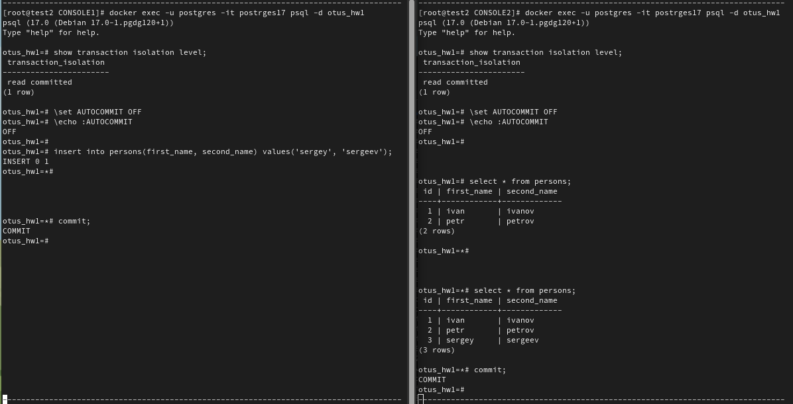
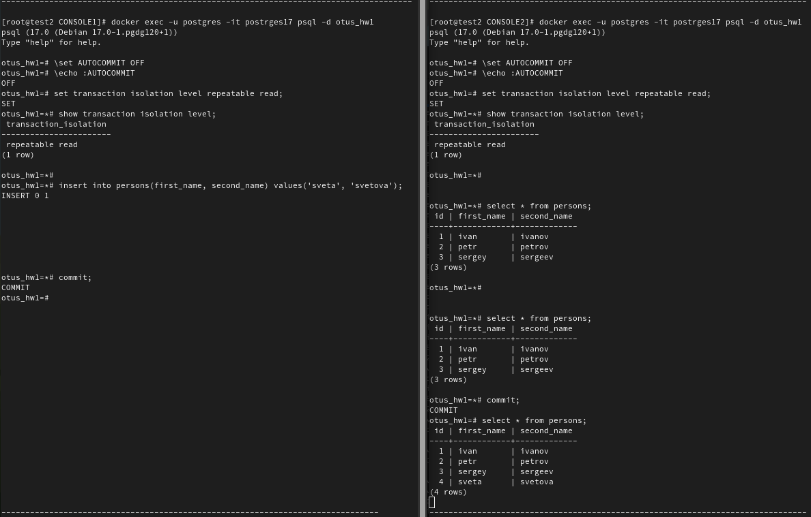

# **HW-1 | Работа с уровнями изоляции транзакции в PostgreSQL**


## **Цель:**
    Научиться управлять уровнем изоляции транзации в PostgreSQL   
  и понимать особенность работы уровней read commited и repeatable read


## **Выполнение домашнего задания**
### **Установим postrges17 в докере:**
```console
[hw-1]# docker run --name postrges17 -e POSTGRES_PASSWORD=$(pwgen -n 12 1) -d postgres:17.0
Unable to find image 'postgres:17.0' locally
17.0: Pulling from library/postgres
a480a496ba95: Pull complete 
f5ece9c40e2b: Pull complete 
241e5725184f: Pull complete 
6832ae83547e: Pull complete 
4db87ef10d0d: Pull complete 
979fa3114f7b: Pull complete 
f2bc6009bf64: Pull complete 
c9097748b1df: Pull complete 
9d5c934890a8: Pull complete 
d14a7815879e: Pull complete 
442a42d0b75a: Pull complete 
82020414c082: Pull complete 
b6ce4c941ce7: Pull complete 
42e63a35cca7: Pull complete 
Digest: sha256:8d3be35b184e70d81e54cbcbd3df3c0b47f37d06482c0dd1c140db5dbcc6a808
Status: Downloaded newer image for postgres:17.0
bd16920a36059c0e8e263358a1e79b885a168abfe92ef5c3fcf3655562946171

[hw-1]# docker ps 
CONTAINER ID   IMAGE           COMMAND                  CREATED         STATUS         PORTS      NAMES
bd16920a3605   postgres:17.0   "docker-entrypoint.s…"   5 seconds ago   Up 5 seconds   5432/tcp   postrges17
```

### **Создадим тестовую базу и таблицу c данными для теста** 
```console
[root@test2 tmp]# docker exec -u postgres -it postrges17 psql
psql (17.0 (Debian 17.0-1.pgdg120+1))
Type "help" for help.

postgres=# create database otus_hw1;
CREATE DATABASE
postgres=# \c otus_hw1
You are now connected to database "otus_hw1" as user "postgres".
otus_hw1=# 
otus_hw1=# \set AUTOCOMMIT OFF
otus_hw1=# \echo :AUTOCOMMIT
OFF
otus_hw1=# 
otus_hw1=# create table persons(id serial, first_name text, second_name text);
insert into persons(first_name, second_name) values('ivan', 'ivanov');
insert into persons(first_name, second_name) values('petr', 'petrov');
commit;
CREATE TABLE
INSERT 0 1
INSERT 0 1
COMMIT
```


## **Уровень изоляции Read Committed**
### **Ход проверки:**
- проверяем текущий уровень изоляции
- начинаем новую транзакцию в обоих сессиях с дефолтным (не меняя) уровнем изоляции
- в первой сессии добавляем новую запись
- во второй сессии проверяем содержимое таблицы  
  и видим отсутствие изменений осуществленные в "не завершенной первой транзакцией".  
  Изменения не видны т.к. при уровне изоляции **Read Committed** гарантируется отсутствие эффекта  
  "**Грязное чтение**"
- в первой сессии завершаем транзакцию
- во второй сессии проверяем содержимое таблицы  
  и в этот раз мы видим новую запись в таблице.  
  Это случилось, т.к. при уровне изоляции **Read Committed**, не гарантируется отсутствие эффектов   
  "**Неповторяемое чтение**" и "**Фантомное чтение**"

### **Полный скрин хода проверки при уровне изоляции Read Committed показан на скрине:**



## **Уровень изоляции Repeatable Read**
### **Ход проверки:**
- начинаем новые но уже **repeatable read** транзакции
- в первой сессии добавляем новую запись
- во второй сессии проверяем содержимое таблицы  
  и видим отсутствие изменений осуществленные в "не завершенной первой транзакцией".  
  Изменения не видны т.к. при уровне изоляции **Repeatable Read** гарантируется отсутствие эффекта  
  "**Грязное чтение**"
- в первой сессии завершаем транзакцию
- во второй сессии проверяем содержимое таблицы  
  и видим отсутствие изменений осуществленные "завершенной первой транзакцией".  
  Изменения не видны т.к. при уровне изоляции **Repeatable Read** гарантируется отсутствие эффектов:  
  "**Неповторяемое чтение**" и "**Фантомное чтение**"
- во второй сессии завершаем вторую транзакцию и проверяем содержимое таблицы  
  и в этот раз мы видим новую запись в таблице.  
  Это нормальное поведение, т.к. по факту мы увидели изменения в "новой транзакции",   
  которая началась после первой транзакции.

### **Полный скрин хода проверки при уровне изоляции Read Committed показан на скрине:**

