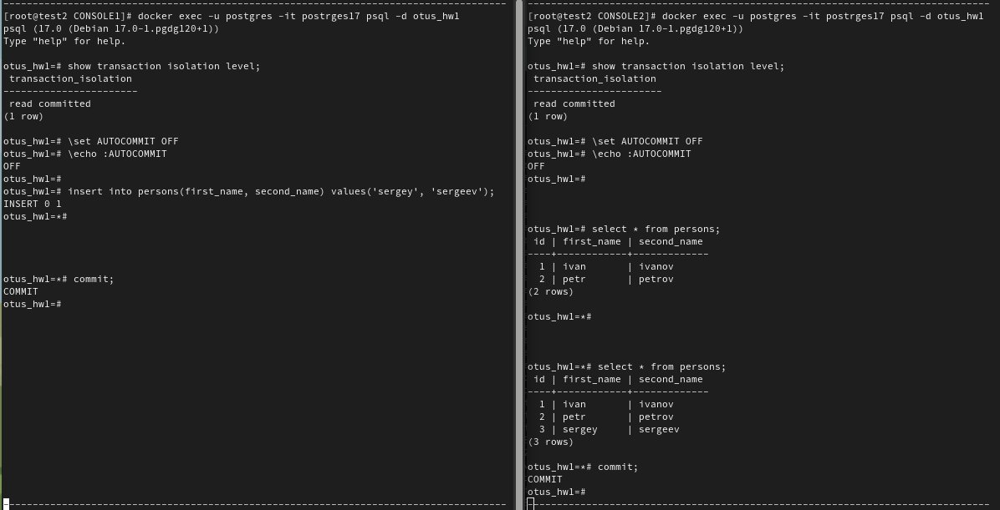
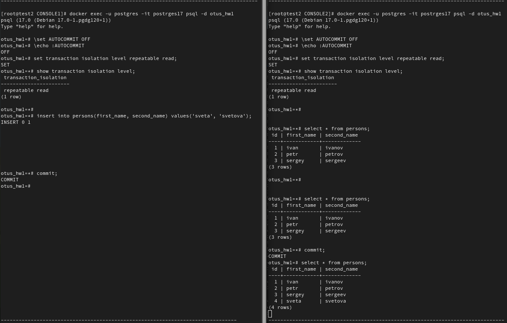

# **HW-1 | Работа с уровнями изоляции транзакции в PostgreSQL**

## **Цель:**
    Научиться управлять уровнем изоляции транзации в PostgreSQL   
  и понимать особенность работы уровней read commited и repeatable read

## **Описание/Пошаговая инструкция выполнения домашнего задания:**
 - создать новый проект в Яндекс облако или на любых ВМ, например postgres2024-, где yyyymmdd год, месяц и день вашего рождения (имя проекта должно быть уникально)
 - далее создать инстанс виртуальной машины с дефолтными параметрами - 1-2 ядра, 2-4Гб памяти, любой линукс, на курсе Ubuntu 100%
 - добавить свой ssh ключ
 - зайти удаленным ssh (первая сессия), не забывайте про ssh-add
 - поставить PostgreSQL из пакетов apt install
 - зайти вторым ssh (вторая сессия)
 - запустить везде psql из под пользователя postgres
 - выключить auto commit
 - сделать в первой сессии новую таблицу и наполнить ее данными
```console
   create table persons(id serial, first_name text, second_name text);
   insert into persons(first_name, second_name) values('ivan', 'ivanov');
   insert into persons(first_name, second_name) values('petr', 'petrov');
   commit;
```
 - посмотреть текущий уровень изоляции:
```console
   show transaction isolation level
```
 - начать новую транзакцию в обоих сессиях с дефолтным (не меняя) уровнем изоляции
 - в первой сессии добавить новую запись  
```console
   insert into persons(first_name, second_name) values('sergey', 'sergeev');
```
 - сделать во второй сессии  
```console
   select * from persons
```
 - видите ли вы новую запись и если да то почему?
 - завершить первую транзакцию
```console
   commit;
```
 - сделать во второй сессии  
```console
   select * from persons
```
 - видите ли вы новую запись и если да то почему?
 - завершите транзакцию во второй сессии
 - начать новые но уже repeatable read транзакции
```console
   set transaction isolation level repeatable read;
```
 - в первой сессии добавить новую запись  
```console
   insert into persons(first_name, second_name) values('sveta', 'svetova');
```
 - сделать во второй сессии  
```console
   select * from persons
```
 - видите ли вы новую запись и если да то почему?
 - завершить первую транзакцию  
```console
   commit;
```
 - сделать во второй сессии   
```console
   select * from persons
```
 - видите ли вы новую запись и если да то почему?
 - завершить вторую транзакцию  
```console
   commit;
```
 - сделать во второй сессии   
```console
   select * from persons
```
 - видите ли вы новую запись и если да то почему?

## **Подготовительные работы**
### **Установим postrges17 в докере:**
```console
[hw-1]# docker run --name postrges17 -e POSTGRES_PASSWORD=$(pwgen -n 12 1) -d postgres:17.0
Unable to find image 'postgres:17.0' locally
17.0: Pulling from library/postgres
a480a496ba95: Pull complete 
f5ece9c40e2b: Pull complete 
241e5725184f: Pull complete 
6832ae83547e: Pull complete 
4db87ef10d0d: Pull complete 
979fa3114f7b: Pull complete 
f2bc6009bf64: Pull complete 
c9097748b1df: Pull complete 
9d5c934890a8: Pull complete 
d14a7815879e: Pull complete 
442a42d0b75a: Pull complete 
82020414c082: Pull complete 
b6ce4c941ce7: Pull complete 
42e63a35cca7: Pull complete 
Digest: sha256:8d3be35b184e70d81e54cbcbd3df3c0b47f37d06482c0dd1c140db5dbcc6a808
Status: Downloaded newer image for postgres:17.0
bd16920a36059c0e8e263358a1e79b885a168abfe92ef5c3fcf3655562946171

[hw-1]# docker ps 
CONTAINER ID   IMAGE           COMMAND                  CREATED         STATUS         PORTS      NAMES
bd16920a3605   postgres:17.0   "docker-entrypoint.s…"   5 seconds ago   Up 5 seconds   5432/tcp   postrges17
```

### **Создадим тестовую базу и таблицу c данными для теста** 
```console
[root@test2 tmp]# docker exec -u postgres -it postrges17 psql
psql (17.0 (Debian 17.0-1.pgdg120+1))
Type "help" for help.

postgres=# create database otus_hw1;
CREATE DATABASE
postgres=# \c otus_hw1
You are now connected to database "otus_hw1" as user "postgres".
otus_hw1=# 
otus_hw1=# \set AUTOCOMMIT OFF
otus_hw1=# \echo :AUTOCOMMIT
OFF
otus_hw1=# 
otus_hw1=# create table persons(id serial, first_name text, second_name text);
insert into persons(first_name, second_name) values('ivan', 'ivanov');
insert into persons(first_name, second_name) values('petr', 'petrov');
commit;
CREATE TABLE
INSERT 0 1
INSERT 0 1
COMMIT
```

## **Скрин read_committed**


## **Скрин repeatable_read**

